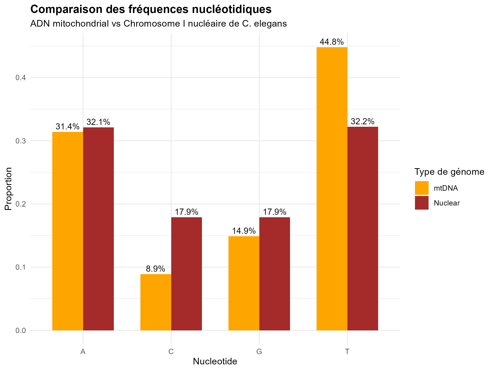

# 🧬 Nucleotide Bias Analysis in *C. elegans* Mitochondrial Genome

## 📌 Project Overview

This project analyzes the nucleotide composition (A, C, G, T) of the mitochondrial genome (mtDNA) of *Caenorhabditis elegans* using R and Bioconductor.

The main objective was to test whether the nucleotide frequencies follow a **uniform distribution** (25% for each base) and to compare the mitochondrial genome with the nuclear genome (chromosome I).

---

## 🎯 Objectives

- Calculate nucleotide frequencies in mtDNA and nuclear DNA
- Test the uniform distribution hypothesis using Monte Carlo simulation (10,000 iterations)
- Compare mitochondrial vs nuclear genome composition
- Visualize the results with ggplot2

---

## 🧪 Key Results

- Strong **AT bias** in mitochondrial genome: **76.2%** (T: 44.8%, A: 31.4%)
- Significant violation of Chargaff's rule (A ≠ T and G ≠ C) in mtDNA
- Monte Carlo simulation (10,000 simulations): **Chi² = 7835.13**, **p-value = 0**
- Clear compositional difference between mitochondrial and nuclear genomes

**Conclusion**: The nucleotide distribution in *C. elegans* mtDNA is **not uniform** and exhibits strong biological bias.

---

## 🛠️ Tools & Technologies

- **R** & RStudio
- **Bioconductor**: Biostrings, BSgenome.Celegans.UCSC.ce2
- tidyverse & ggplot2
- Monte Carlo Simulation
- Quarto

---

## 📊 Visualization



---

## 📁 Project Structure

```bash
C-elegans-mtDNA-analysis/
├── C_elegans_mtDNA_analysis.qmd
├── README.md
├── figures/
├── scripts/
└── .Rproj

---
👨‍🎓 Author
AGBO K. Doris
Agronomy Student | Bioinformatics & Data Analysis Enthusiast
Interests: Genomic Data Analysis, Biostatistics, Sustainable Agriculture, Plant Breeding
